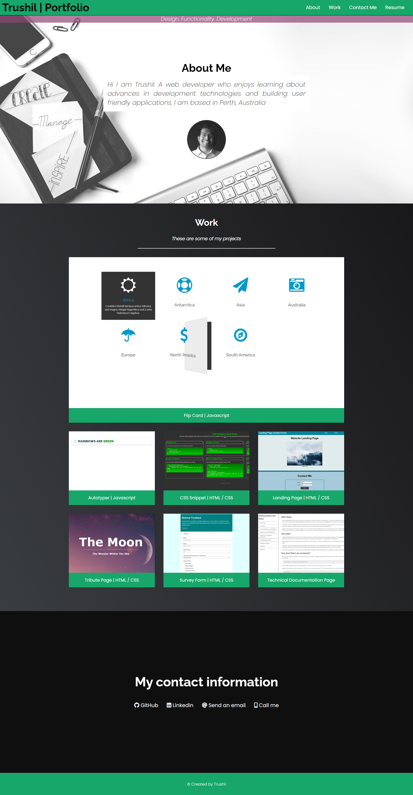

# Portfolio

## Description

The portfolio page contains information about myself and provides examples of the coding work I have done before. Information to contact me has also been provided in the webpage. 

## Assets

The following image shows the web application's appearance and functionality:

> **Note**: This layout is responsive.

## Link

The link to the deployed application:

Trushil Portfolio: https://trushilbudhia.github.io/Portfolio/
