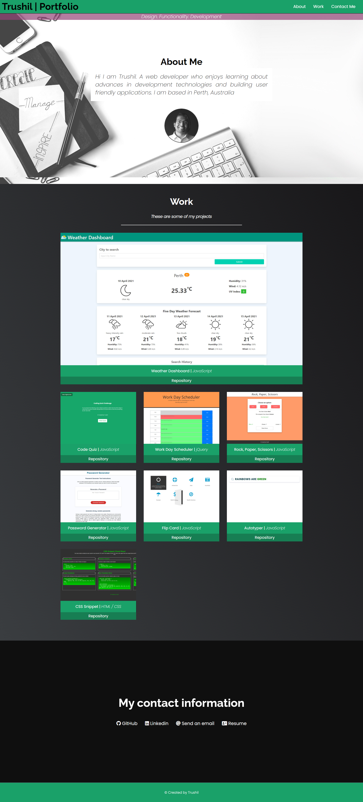

# Portfolio

## 📖Table of Contents
1. [Description](#description)
2. [Link](#Link)
3. [Screenshots](#Screenshots)
4. [Technologies](#Technologies)
5. [Contributing](#Contributing)
6. [Author](#Author)
7. [License](#License)

## Description

The portfolio page contains information about myself and provides examples of the coding work I have done before. 

Information to contact me has also been provided in the webpage.

The webpage is responsive.

## Link

The link to the deployed application:

Trushil Portfolio: https://trushilbudhia.github.io/Portfolio/

## Screenshots

The following images shows the web application's appearance and functionality:

> **Note**: This layout is responsive.

## Technologies
- HTML
- CSS
- Font Awesome (icons)
- [Bulma](https://bulma.io/)

## Contributing
Contributions, issues and feature requests are welcome.

Feel free to check [issues page](https://github.com/TrushilBudhia/Portfolio/issues) if you want to contribute.

## Author
👤Trushil Budhia
- Github: [@Trushil](https://github.com/TrushilBudhia)
- Email: trushil.budhia@gmail.com

## License
Copyright © 2021 [Trushil](https://github.com/TrushilBudhia)

This project is [MIT](./LICENSE) licensed
